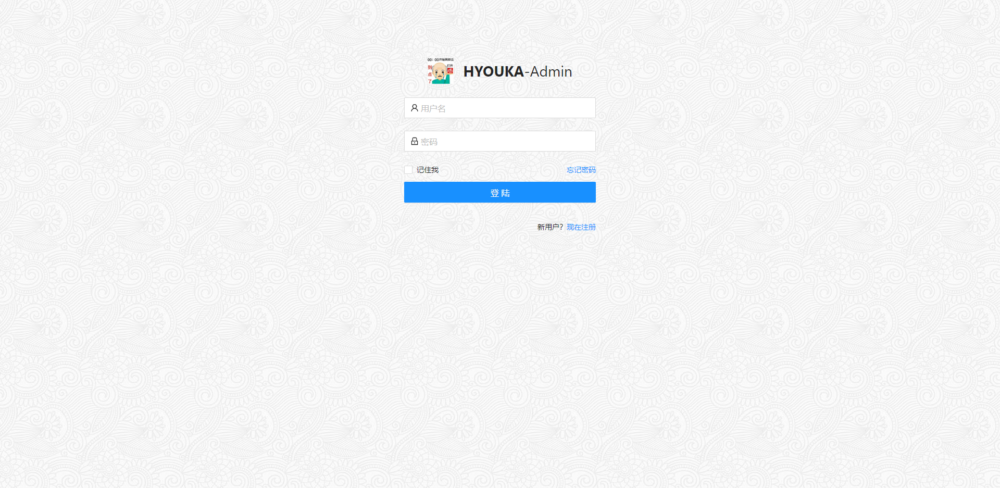
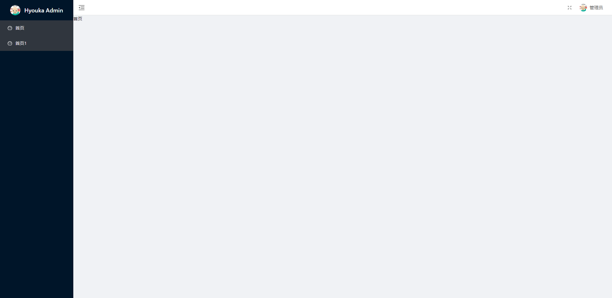

<p align="center">
  
</p>

<p align="center">
  <a href="https://react.docschina.org/">
    
  </a>
  <a href="https://ant.design/index-cn">
    
  </a>
  <a href="https://github.com/JedWatson/classnames#readme">
    
  </a>
  <a href="https://www.lodashjs.com/">
    
  </a>
</p>

简体中文

## 总览

[react-typescript-antd-admin](https://github.com/HyoukaM/react-antd-admin) 是一个后台前端管理系统，它基于 [react](https://react.docschina.org/), [typescript](https://www.typescriptlang.org/), [dva](https://dvajs.com/) 和 [ant-design](https://ant.design/index-cn) 实现。

## 线上文档(README.MD)

[文档](https://github.com/HyoukaM/react-antd-admin)

## 线上地址

[示例](https://github.com/HyoukaM/react-antd-admin)

## 截图




## 功能

```txt
- 登录 / 注销

- 权限验证
  - 页面权限
  - 指令权限
  - 权限配置
  - 二步登录

- 全局功能
  - 动态换肤(还在开发)
  - 动态侧边栏（支持多级路由嵌套）
  - 动态面包屑(还在开发)
  - 快捷导航(支持右键操作)
  - Svg 图标
  - 全屏
  - 设置(还在开发)

- 组件
  -会陆续开发

- 表格
  -会陆续开发

- Excel
  -会陆续开发

- Zip
  -会陆续开发

- PDF
  -会陆续开发

- 错误日志
- 错误页面
  - 401
  - 404
```

## 前序准备

你需要在本地安装 [node](http://nodejs.org/) 和 [git](https://git-scm.com/) 。
本项目技术栈基于 [typescript](https://www.typescriptlang.org/) 、[react](https://react.docschina.org/) 、[react-redux](https://www.redux.org.cn/) 、[react-router || react-router-dom](https://reactrouter.com/) 、[axios](https://github.com/axios/axios), [dva](https://dvajs.com/) 和 [ant](https://ant.design/index-cn) ，所有的请求数据都使用[faker.js](https://github.com/Marak/Faker.js) 进行模拟，提前了解和学习这些知识会对使用本项目有很大的帮助。

## 目录结构

本项目已经为你生成了一个完整的开发框架，提供了涵盖后台开发的各类功能和坑位，下面是整个项目的目录结构。

```bash
├── public                     # 静态资源 (会被直接复制)
│   │── favicon.ico            # favicon图标
│   │── manifest.json          # PWA 配置文件
│   └── index.html             # html模板
├── src                        # 源代码
│   ├── api                    # 所有请求
│   ├── assets                 # 主题 字体等静态资源 (由 webpack 处理加载)
│   ├── components             # 全局组件
│   ├── layout                 # 全局布局
│   ├── router                 # 路由
│   ├── store                  # 全局 react-redux
│   ├── styles                 # 全局样式
│   ├── utils                  # 全局方法
│   ├── views                  # 所有页面
│   ├── core.d.ts              # 核心定义接口
│   ├── index.tsx              # 入口页面
│   ├── serviceWorker.ts       # 服务配置文件
│   └── shims.d.ts             # 模块注入
├── babel.config.js            # babel-loader 配置
├── config-overrides.js        # webpack配置文件
├── package.json               # package.json 依赖
├── postcss.config.js          # postcss 配置
├── tsconfig.json              # typescript 配置
```

## 如何设置以及启动项目

### 安装依赖

```bash
$ yarn install
$ npm install
```

### 启动本地开发环境（自带热启动）

```bash
$ yarn start
$ npm run start
```

### 构建生产环境 (自带压缩)

```bash
$ yarn build
$ npm run build
```

### 运行单元测试

```bash
$ yarn test
```


### 自定义 webpack(最好不要 npm run eject 抛出webpack配置文件) 配置

请看 [customize-cra](https://github.com/arackaf/customize-cra#readme).

## 浏览器支持

Modern browsers and Internet Explorer 10+.

| [](http://godban.github.io/browsers-support-badges/)</br>IE / Edge | [](http://godban.github.io/browsers-support-badges/)</br>Firefox | [](http://godban.github.io/browsers-support-badges/)</br>Chrome | [](http://godban.github.io/browsers-support-badges/)</br>Safari |
| --------- | --------- | --------- | --------- |
| IE10, IE11, Edge| last 2 versions| last 2 versions| last 2 versions

